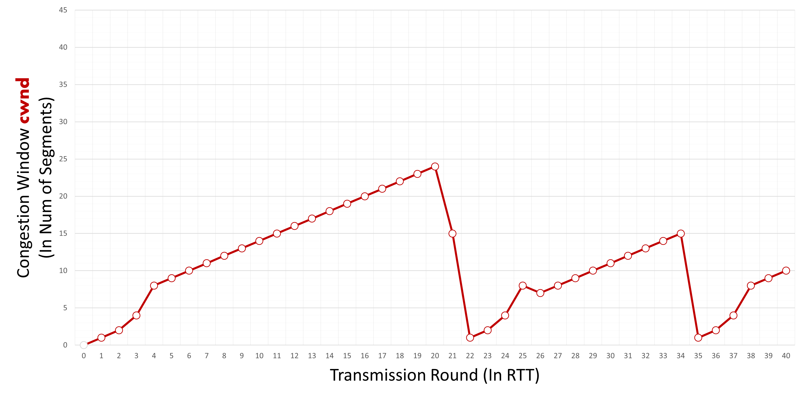

___
1Q: You bring two laptops to NJIT, you intend to ssh from one computer to another, select what networking technologies you’ve learnt in CS356 that would NOT be involved in achieving this goal:\
A:
___
2Q:How many more handshakes happen for a connection employing TCP than a connection employing UDP?\
A: 3. UDP Requires 0, TCP requires 3.
___
3Q:What are the generally accepted characteristics of message segmentation in terms of the following? (time count when applicable)\
A:
1. _______ overhead
    * more
2. _______ retransmission
    * less/fewer
3. _______ loss
    * less/fewer
4. ________ delay
    * more 

___
4Q:Once you purchase your domain name from an Internet registrar, you either can use the name servers they provide or update them with your own name servers and their corresponding IP addresses. The type(s) of these DNS servers is/are\
A: ________ 
* ~~root~~
* ~~top-level domain~~
* authoritative
* local

and the type(s) of DNS records to be inserted into the DNS distributed database include(s) ________
* NS
* NS and A
* ~~NS and MX~~
* ~~A~~
* A and MX

___
5Q:Most major e-commerce sites use \
A: Most major e-commerce sites use _______.

1. proxy servers
2. **cookies** <-- I believe this was right, not 100%.
3. extra memory
4. caches
5. load balancers

today to track their customers’ activities at their site. This is because HTTP itself  _________.

1. ~~does not have RDT~~
2. ~~Only limits to several operations: (GET PUT, etc)~~ 
3. **is stateless**
4. has limited memory capabilities
___
6Q:According to the following cwnd graph, we agree that it is completely possible that the transmission round(s) within which the connection experiences a triple-duplicated-ack event are 20, 25, 31 
\
A: False\
Explanation:
at T=20 we can see window size is reduced from 24 to 2. But in case of triple duplicate ack window should become half of cwnd means it should become 12 not 2.

For T=25 it is falling from 8 to 6 which is not half of 8(cwnd). So it is not triple duplicate ack event.

For T=31 it is leniarly increasing. so there will be no fall and duplicate acks.

So finally answer is false because for answer true all must be triple duplicate ack.
___
7Q:Using traceroute, the source host can reconstruct the route from the source to the destination. For example, there are 10 routers between the source and the destination, the source host will send a total of\
A: X packets to the destination. Each of these packets will be sent to the destination and marked by a number. These numbers are X. When the i-th router receives the i-th marked packet, it will send a message back to the source. The source will record the name and IP address of the network device that it receives the message from. In addition, the source can determine the round-trip delays to all routers measured in X.
___
8Q:You walk down the electronic aisle in a shopping center, you pick up a device that boasts the following: “Homes come in all shapes and sizes. This device is designed to provide medium-sized homes with superior WiFi connectivity for fast, lag-free gaming, video streaming, and surfing. Certified with Xfinity with speeds up to 200Mbps and with Cox service speeds of 150Mbps. (This product does not support home phone services from cable providers).” Based on this description, the type of this network device is\
A: X. It can be used to X
___
9Q:You are considering Verizon Fios as your ISP. You notice the difference between Fios and other \
A: ________
* WAN
* region
* access
* **LAN** 
* last mile

 ISPs. Other ISPs use both coaxial cable and fiber options while Fios offers a 100% fiber-optic network, and was one of the first ISPs to offer 100% “Fiber to the Home” (FTTH) internet services to residential customers. Many other providers use fiber-to-the-node (FTTN) connections, which use fiber cables to carry data to a hub close to your home and then switch to coaxial cables or copper wire for the ________.
 * WAN
 * region
 * **access**
 * LAN
 * last mile

___
10Q: Based on the provided graph following TCP Reno, enter the transmission round(s) within which the connection is in the slow-start phase in ascending order. Separate each round number with a ',' without space. No comma should follow the last entry. If no transmission round applies, enter '0'. Initial ssthresh = 8.\
\
A: 8,15,22,31,35\
Explanation: 

Value of threshold changes when either triple duplicate acknowledgement or timeout occurs.

The changes is seen when the window size changes.

From the given diagram, the threshold value change at point 8,15,22,31,35

___
11Q:Select the main application-layer protocol and corresponding underlying transport protocol for several popular applications:\
A: Electronic mail: SMTP,TCP
Remote terminal access: Telnet,TCP
Streaming multimedia: DASH,TCP
Web browser: HTTP,TCP
___
12Q:Based on the provided graph following TCP Reno, enter the transmission round(s) within which the connection experiences a time-out event in ascending order. Separate each round number with a ',' without space. No comma should follow the last entry. If no transmission round applies, enter '0'. Initial ssthresh = 8.\
\
A:21,34\
Explanation: 

In case of timeout, congestion window size drops to 1 and TCP enters in slow start phase again.

Here total number of time window size drops to 1 is 2

Thus transmission round during which timeout occured is 21,34

___
13Q:Based on the provided graph following TCP Reno, enter the transmission round(s) within which the connection is in Fast Recovery phase in ascending order. Separate each round number with a ',' without space. No comma should follow the last entry. If no transmission round applies, enter '0'. Initial ssthresh = 8.\
\
A: 8,15,31\
Explanation:\

Congestion window size decreases rapidly during this period and grows linearly as the situation improves. Triple acknowledgment causes TCP to enter a rapid recovery mode. The value of the window decreases at around eight and then grows linearly afterward, as seen in the figure. Thus, the rapid recovery phase is 8,15,31 minutes.
___
14Q:You are at home and have in front of you two laptops. You intend to ssh from one computer to another but using the NJIT network. Realistically, select what you need to achieve your goal: 

To obtain an IP address internally to NJIT:
1. Cisco AnyConnect
2. **DHCP Server**

To ssh from client to server:
1. **openSSH**
2. LAN
3. RSA
4. IMAP
___
15Q:You notice that Netflix offers its services in other regions of the world. You know that your account can be used worldwide but Netflix servers will determine the content you can watch based on the IP address it can see from your host. You are determined to watch programs that are not yet available in the US. Thus, you think of purchasing the right to access a __________ in the region which contains the content you want to watch.\

A:
**VPN**
___
16Q:When you bring your laptop to NJIT, applying what we’ve learned in class (not in reality), which of the following values is NOT a possible IP address your laptop will obtain from NJIT’s network?

# There was another answer to this question

A:
1. 123.45.67.89
2. **192.168.256.2 <-- Valid range is 0-255**
3. 192.168.0.1
4. 172.29.10.9
5. ~~10.1.0.0~~
___
17Q:Wireshark is capable of real-time intrusion detection. To determine whether the traffic is normal, the user has to compare Wireshark's network reports against several benchmarks: networks of the same business size and type, previous network reports, network expectations based on original intended design.\
A: X:t/f???
___
18Q:Content creators upload to Youtube several million videos everyday. 
They upload their videos from client to server over __________

1. **HTTP**
2. IMAP
3. DASH
4. SMTP

Not only that, YouTube videos streamed from server to client over  __________
1. ~~DASH~~
2. **HTTP**
3. TCP  
4. BGP
___
19Q:HTTP/2 solves the Head-of-line blocking by breaking each message into small frames, and interleaving the request and response messages on\
A: X. In addition, it can send multiple responses for a single client request. This ability is known as X
___
20Q:The difference between selective repeat and go-back-N is the number of timers it needs tracking. Denote the number of packets sent but not yet ack’ed = a, the number of packets sent and ack’ed = b, the size of the window = N, the number of slots useable but not yet sent = c. What is the number of timers that selective repeat needs tracking at any moment?\
A: N\
Explanation:   

In the selective repeat, the number of timers needed is equal to buffer (window size) hence needed timer is N, in another word needed timer is equal to the maximum number of packets it is allowed to send
___
21Q:This is an example of Connectionless Demultiplexing. Type your answer without space in order of the ‘?’ from top to bottom, separated by commas.\
\
A:
**6428,5775,5775,6428**
___
22Q: 45 Terabytes need to be sent from Boston to Los Angeles. FedEx overnight will reach the destination in 12.5 hours. If a dedicated link can be used to send the data, what should be its transmission rate (Mbps)  to break even?

```
Note that Mbps != MBps. 
Little b represents bits
Big B represents bytes

1 Byte = 8 bits
```

Common units

| Kilo | 10^3  |
|------|-------|
| Mega | 10^6  |
| Giga | 10^9  |
| Tera | 10^12 |


Units used:
```
Mega = 10^6
Tera = 10^12
```

1. Convert terabytes to bits (not bytes)

Conversion from ``TeraByte->Bit`` = ``45*(10^12)*8`` = ``3.6*(10^14) bits``

2. Divide total bits by our unit size (Megabit = 10^6) to get the number megabits

``(3.6(10^14))/(10^6) = 3.6*(10^8) Megabits``

3. Convert time to seconds
Time in hours: 12.5
``(12.5 hours) * (60 minutes) * (60 seconds) = 45000 seconds``

4. Calculate transmission rate (size/time)

``(3.6*(10^8))/45000 = 8000 Mbps (megabits per second)``
___
23Q:There are M paths from source to destination. Denote R_i_k the transmission rate of link i in path k. No two paths shared the same link. If the server can use all paths, what is the maximum throughput?\
A:
* max(sum{R_i_k}) for i = 1 … M and k = 1 … n
* sum(product{R_i_k}) for i = 1… n and k = 1 … M
* sum(max{R_i_k}) for i = 1 … M and k = 1 … n
* product(min{R_i_k}) for i = 1 … n and k = 1 … M
* **sum(min{R_i_k}) for i = 1 … n and k = 1 … M**

___
24Q:You have four routers connecting to each other in a way that each router can be directly connected to the other three. How many subnets are there in this setup?\
A: 1024\
Explanation: For each router there can be 256 subnets and for four routers there will be 1024 subnets.
___
25Q:\
A: ________
* QUIC
* **DASH**
* DNS
* DHCP

allows the HTTP server to store a ________
* dynamic
* **manifest**
* latent
* hidden
 
file which contains URLs for each chunk of a video by bit-rate version. While downloading chunks, ________
* both the client and server
* the server
* **the client**
 
measure(s) the received bandwidth to determine which URL should be next.
___
26Q:A Content Distribution Networks (CDNs) installs many geographically distributed ______ (a.k.a. proxy servers) throughout the region it services, thereby localizing much of the traffic.\
A: Caches\
Explanation:
A content delivery network (CDN) refers to a group of geographically distributed servers that work together to provide fast delivery of Internet content. A CDN enables the rapid transfer of the resources needed to load Internet content, including HTML pages, javascript files, stylesheets, images, and videos.web caches are increasingly playing an important role in the internet CDN installs many geographically distributed caches throughout the internet, thereby localizing much of the traffic.
___
27Q:It takes 75ms to reach from your host to the cloud where you run two machines. It takes roughly 2 ms to traverse from one VM to another. Sitting from your home, you ssh into one network then ping the other one. How long in ms will it take roughly after you type ‘ping x.x.x.x’ in the terminal to get the response from the other one?\
A:4\
Explanation :

We are in Home and On same one Network so,

Both machines are in the same network then it takes 1 Round Trip Time (RTT) to get a response.

1 RTT = Machine 1 to Machine 2 a

nd then Machine 2 to Machine 1.

1 RTT = 2ms + 2ms = 4 ms.
___
28Q:We use end-point authentication to determine with certainty the _________
* **source**
* destination

of a message. Authentication is needed because it is ________ 
* sometimes possible
* **easy**

to hand-craft a packet with an arbitrary source /destination address and port number. This ability is known as _________
* injecting
* self-replicating
* **IP spoofing**
* man-in-the-middle

___
29Q:There are M paths from source to destination. Denote R_i_k the transmission rate of link i in path k. No two paths shared the same link. If the server can only use 1 path, what is the maximum throughput?\
A:
* max(min{R_i_k}) for i = 1 … M and k = 1 … n 
* min(max{R_i_k}) for i = 1 … M and k = 1 … n 
* min(max{R_i_k}) for i = 1 … n and k = 1 … M 
* **max(min{R_i_k}) for i = 1 ... n and k = 1 … M**
___
30Q:Based on the provided graph following TCP Reno, enter the transmission round(s) at which the value of ssthresh changes in ascending order. Separate each round number with a ',' without space. No comma should follow the last entry. If no transmission round applies, enter '0'.Initial ssthresh = 8.\
\
A:
___
31Q:\
A: ________ protocol provides the ability to translate hostnames to IP addresses. 
* **DNS**
* BGP
* ICMP
* SIP
  
Without appropriate entries within it, no one can access a website even if it is of a too-big-too-fail company such as facebook.com. It is a ________
* network
* transport
* physical
* link
* **application**
  
-layer protocol and is a great example of the design philosophy that much of the complexity in the Internet architecture is located at the ________
* **edge**
* core

of the network.
___
32Q: When you watch Netflix, you know that the content is being streamed either from an access ISP or  from a server at a nearby Internet exchange point that has Netflix CDN server rack installed within it. This is possible thanks to the fact that Netflix uses DNS to redirect to connect a particular client to a CDN server.

**False**
___
33Q:Based on the provided graph following TCP Reno, enter the transmission round(s) at which the value of ssthresh changes in ascending order. Separate each round number with a ',' without space. No comma should follow the last entry. If no transmission round applies, enter '0'. Initial ssthresh = 8.\
\
A: Chegg: https://www.chegg.com/homework-help/questions-and-answers/based-provided-graph-following-tcp-reno-enter-transmission-round-s-value-ssthresh-changes--q89744557
___
34Q:Given\
d: distance between each pair of network devices\
R: the link’s transmission rate\
a: average rate of arrival\
L: packet length\
s: propagation speed\
t1: time to examine packet’s header to determine forwarding action\
t2: time to perform bit-level error check\
Identify the types of delay in packet-switched networks. Choose all that apply.\
A:
* Transmission delay = L/R
* Propagation delay = s/d
* Processing delay = t1 + t2
* Queuing delay (varies at each node)
___
35Q:For the vast number of technological start-ups, which layer are they mostly working in considering the five-layer Internet protocol stack?\
A:
* Network layer
* Link layer
* Physical layer
* **Application layer**
* Transport layer

___
36Q:Based on the provided graph following TCP Reno, enter the minimum value of ssthresh. Initial ssthresh = 8.\
\
A: Chegg: https://www.chegg.com/homework-help/questions-and-answers/based-provided-graph-following-tcp-reno-enter-minimum-value-ssthresh-initial-ssthresh-8-q89745332
___
37Q:Multiple ISPs can peer together at\
A:X. Any ISP (except for tier-1 ISP) can choose to X  to connect to two or more provider ISPs. This means that in the event that one of its provider IPSs is down, it can still continue to send and receive packets into the Internet.
___
38Q:Fill in each blank with one word. Separate your answer using commas. No space in front of or after a comma.\
One of the biggest costs of congestion is that _____________ transmission capacity and buffering are wasted for every packet lost _______________.\
A: upstream,dropped
Explanation\
When a lost packet is dropped, we are wasting the channel capacity along with buffer.
___
39Q:You are requesting a webpage with three images stored in three different servers. One of the images  resides on the same server as the webpage. Assuming that you are using HTTP/1.1, and your web browser can open up to 3 parallel connections. Ignore transmission time, how many persistent TCP connections will you need? And how many RTTs will you need to get the entire web page displayed? Type your answer in the order of the question asked, separated by a comma, no unit of measurement should be used, no space\
A:idk how she wants it typed
Explanation:\


Following is the sequencing, happening at each RTT :

    t = 0 to RTT-1 :
        TCP-1 is opened (with 1st server).
    t = RTT-1 to RTT-2 :
        Webpage is fetched using TCP-1.
    t = RTT-2 to RTT-3 :
        It is found that the webpage references three images.
        First image is fetched via TCP-1.
        TCP-1 is closed.
        TCP-2 is opened (with 2nd server).
        TCP-3 is opened (with 3rd server)
    t = RTT-3 to RTT-4 :
        Second image is fetched via TCP-2.
        TCP-2 is closed.
        Third image is fetched via TCP-3.
        TCP-3 is closed.

Thus, number of (persistent) TCP connections needed

= 3

Total RTTs needed

= 4

___
40Q:\
Suppose there is a router between two hosts and no other traffic than two packets to be sent from host A to host B. Suppose that the red (i.e. thinner) link is the bottleneck link. Also, suppose that the server sends the second packet T second after sending the first packet. Each packet is of L bits. What is min(T) to ensure no queuing in the router between these two hosts?\
A:
* **L/R_c - L/R_s**
* L/(R_c - R_s)
* L/R_s - L/R_c
* L/(R_s - R_c) 
___
41Q:Mail servers form the core of the e-mail  _______ 
* infrastructure
* architecture 
* ~~backbone~~ <-- I think this one was wrong

These servers communicate with each other using _________. 
* **SMTP**
* HTTPS
* mail agent
* IMAP
As with most application-layer protocols, it has two sides: client side and server side, both of which run on every mail server.
___
42Q:45 Terabytes need to be sent from Boston to Los Angeles. FedEx overnight will reach the destination in 12.5 hours. If a dedicated link can be used to send the data, what should be its transmission rate (Mbps) to break even?\
A:8,388.6 mb/s
Explanation:\
Total Data = 45 Terabytes = 47185920 MB
Total Time = 12.5 Hours = 12.5*60*60 seconds

Data= 47185920 MB
Time = 45,000 s
The Required Transmission Rate(Mb/s) = Data/Time
MB -> Mb
47185920*8 = 377487360

Tranmission speed required is
377487360/45000 Mb/s

= 8,388.6 mb/s
___
43Q:\
A packet has just arrived. Before it are five packets, one of which has 10 bits already transmitted. All packets are transmitted following FIFO.  How long before the first bit of the red packet is transmitted out? All packets have size L bits. Transmission rate is R.\
A:
* (4*L-10)/R 
* 5*L/R - 10 
* **(5*L-10)/R**
* 5*L/R 
___
44Q:Based on the provided graph following TCP Reno, enter the transmission round(s) within which the connection experiences a triple-duplicated-ack event in ascending order. Separate each round number with a ',' without space. No comma should follow the last entry. If no transmission round applies, enter '0'. Initial ssthresh = 8.\
\
A:Whenever a transmission experiences a triple-duplicate ACK event, the sender/transmitter reduces the congestion window by a predefined limit and the transmission enters a congestion-avoidance phase. In the congestion-avoidance phase, the congestion window is increased by a value of 1 MSS(max. Segment Size) after each successful acknowledgement received from the receiver. Hence, in the congestion-avoidance phase, the graph will increase linearly.

Now, let's look at the given graph:
Here, we can see that the congestion window reduces between the following transmission ranges, followed by a congestion-avoidance phase:

    1. 6 to 8
    2. 13 to 15 and
    3. 29 to 31


___
45Q:Based on the provided graph following TCP Reno, enter the transmission round(s) within which the connection is in Fast Recovery phase in ascending order. Separate each round number with a ',' without space. No comma should follow the last entry. If no transmission round applies, enter '0'. Initial ssthresh = 8.\
\
A:8,15,31
Explanation:-

Congestion window size decreases rapidly during this period and grows linearly as the situation improves. Triple acknowledgment causes TCP to enter a rapid recovery mode. The value of the window decreases at around eight and then grows linearly afterward, as seen in the figure. Thus, the rapid recovery phase is 8,15,31 minutes.
___
46Q:You are installing Git, a screen shows the following:\
\
What does this tell you about this git installation? Use what you’ve learned in class to choose the best answer.\
A:
1. I can use SSH to secure all connections initiated from the Git remote repository via a three-way handshake.
2. **I can use SSH as a cryptographic network protocol to communicate over the network to clone a repository or make an update to one. This has two benefits: no repetitive authentication potential (i.e. with setup of key pairs) thus saving time, and my connection is secure.**
3. I can use SSH as a cryptographic network protocol to communicate over the network to clone a repository or make an update to one. This has one benefit: my connection is secure.
4. The screenshot is not possible technically speaking.

47Q:The router is performing UDP Checksum. It receives the following data: 10101010 10101010 11110000 11110000. Enter the expected checksum.\
A: 0110010001100100
Explanation:\


The checksum is a simple method and not so complex to detect an error but the probability to detect error is low as compared to the CRC method.

UDP header uses the 16-bit checksum and it is used to detect the error in the header of the UDP protocol message.

To calculate the checksum of 'n' bits, we divide the data into the segment of 'n' bits and then add all the segments. Finally, the sum is complemented by using one's complement to get the checksum.

The given 16-bit integer in binary format are:

    1010101010101010
    1111000011110000

The sum of the given binary numbers is:

1010101010101010+1111000011110000 = 11001101110011010

Since the result consists of 16 bits only, but there are more than 16 bits in the result.

So extra bits are wrapped around.

The final sum is = 1001101110011011

The one's complement of the sum is = 0110010001100100

So, the checksum is = 0110010001100100


___
48Q:Fill in each blank with one word. Separate your answer using commas. No space in front of or after a comma.\
TCP _______ limits the amount of unACKed data to TCP ________’s free buffer space to ensure the buffer will not overflow. It will have to track two variables, they are lastbysent and lastbyteacked\
A:
___
49Q:In general, an application-layer protocol does NOT define:

A:
1. The syntax of various message types
2. ~~The sequence of message exchanged~~
3. The type of messages exchanged
4. The usage of each field
5. The format of the message exchanged
6. The content of the format of message exchange
7. **Rules of when and how a message is sent or received**

___
50Q:You are installing Git, a screen shows the following:\
\
What does this tell you about this git installation? Use what you’ve learned in class to choose the best answer. \

A:
This means Git uses HTTPS, a secure communication ________

1. **PROTOCOL**
2. channel
3. language
4. setup
   
where two machines can communicate securely over the network by encrypting the data in the _________

1. **APPLICATION**
2. link
3. transport
4. physical
5. network

layer to provide privacy and data integrity between two or more communicating computer applications.
___
